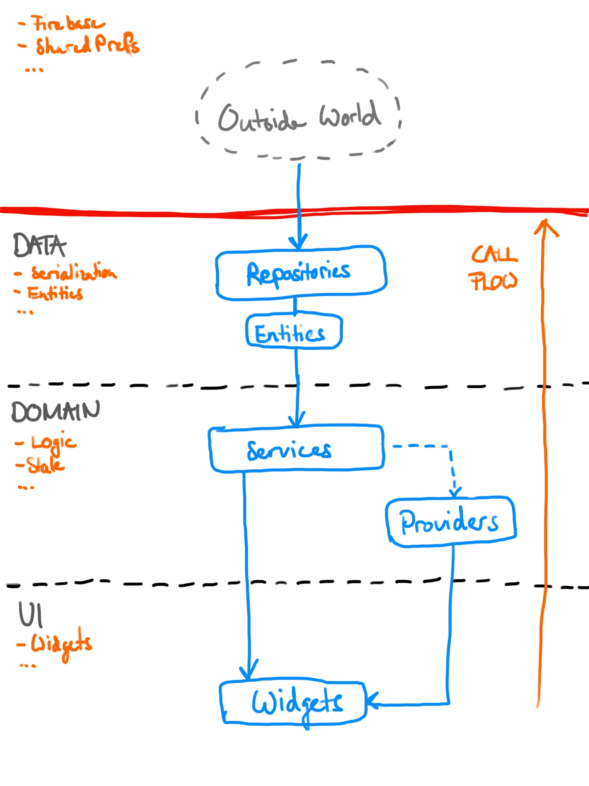

# flutter_firebase_architecture

Layer architecture for flutter app.

- Based of: [Starter Architecture for Flutter & Firebase Apps using Riverpod](https://codewithandrea.com/videos/starter-architecture-flutter-firebase/)

## Architecture Layers
Data, Domain and UI layer with unidirectional data flow.

